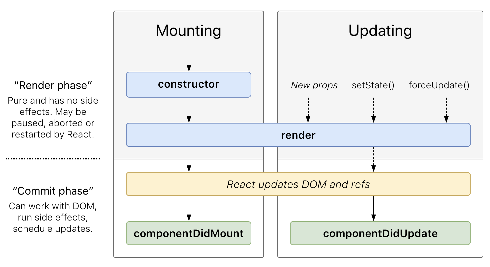

# Curso 2019

Capacitación de JavaScript

[//]: <> ()
[//]: <> ()


---

## Sobre el curso

----

### Docentes

- Ulises Jeremias Cornejo Fandos
- Lucas Di Cunzolo

----

### Objetivos

- Tener una idea general de JS vanilla
- Desarrollar una aplicación React
- Desarrollar un backend en express

----

### Certificaciones

- Desarrollador Frontend React
- Desarrollador Backend Express y Node
- Desarrollador Full Stack JS

----

### Requisitos para las certificaciones

- Asistir al curso
- Contar con una entrega que demuestre los contenidos mínimos de la certificación
  - Las entregas puede contar con reentregas dependiendo el caso

---

## Introducción a JavaScript


----

### Conceptos Básicos

- Tipado Dinámico
- Paradigmas
  - Objetos
  - Funcional
  - Imperativo

----

### Características del lenguaje

Entorno de ejecución

- Cliente
- Servidor
- ¿más?

----

### De JavaScript a los nuevos estandares

Note:
- Vanilla
- ECMAScript
- Otros transpilados (TypeScript, ...)

----

### Comparativas - Vanilla vs ES6

- Require/Import
- "Clases"
- Deconstrucción de valores
- Parámetros rest

---

## JavaScript en la Web

----

- DOM
- Objetos predefinidos
  - window
  - document
  - console (accesible en todo entorno de JS)
  - ...
- Selectores
- Eventos

Note: Ejemplos

----

### Forma antigua de usar JS

- JQuery / Selectors
- Eventos
- Lenguaje para "efectos" en la web

----

### Problematicas comunes de este enfoque

- index.html con muchos tags script
  - Dependencias cruzadas?
  - No hay nada parecido a un import, require o include en un navegador
- No queremos programar mas en Vanilla. Queremos un require!
  - Transpilación

----

### Soluciones

---

### Nuevo enfoque de programación con JS

----

- Uso de manejador de dependecnias
  - npm
  - yarn

----

- Uso de un lenguaje que transpile a JS
  - EcmaScript
  - TypeScript
  - CoffeeScript
  - ...

----

- Uso de herramientas para manejar los archivos estaticos
  - Webpack
  - Parcel
  - Gulp
  - ...

----

### Errores de programación

JavaScript es un lenguaje interpretado sin tipos, propenso a errores en runtime

¿Como hacer para evitar errores?

----

### ESLint

¿Por qué termina siendo necesario aplicar reglas de lint?

¿Por qué se debe seleccionar un estandar que se adapte a nuestro proyecto?

----

### ESLint en diferentes tipos de proyectos JavaScript

- Backend
- Fronted
- Extensiones web
- ...

Note: Comentar diferentes estandares de ESLint

- [aribnb](https://github.com/airbnb/javascript)
- [github](https://github.com/search?q=JavaScript+Style+Guide)

---

## Frontend

----

### Librerías y Frameworks

- Angular
- Vue
- Meteor
- React

---

## React

----

### Principales características

- Programacion basada en componentes
- Declarativo

Note:

[React](https://reactjs.org)

Ver primeras componentes, ejemplos

----

## Construcción

- Component
- PureComponent

Note: Mostrar la diferencia entre crear componentes desde la clase y desde una función render

----

## Propiedades

Todas las componentes pueden recibir propiedades.

Estas propiedades son **inmutables**

Veremos luego que estas propiedades pueden estar tipadas

----

## Estado interno

Casi todas las componentes pueden acceder y modificar su estado interno.

Este estado interno se accede directamente desde `this.props`

Pero se modifica mediante la función `this.setState`

**Nunca se debe modificar directamente el estado interno**

----

## Ciclo de vida básico



Note:

[Ciclos de vida](http://projects.wojtekmaj.pl/react-lifecycle-methods-diagram/)

----

## Ciclo de vida completo sin errores


----

## Ciclo de vida para errores

- `static getDerivedStateFromError`
- `componentDidCatch`

----

## Eventos

----

## Renderizado condicional

----

## Renderizado de componentes mediante listas

----

## Composición

----

## Jerarquía de componentes

React es una librería orientada a objetos

Entonces se prefiere la jerarquía de componentes para evitar código repetido

----


----


---

## Patrones en React

----

En React pueden encontrarse varios patrones de diseño, desde clasicos como el caso del Template method,
hasta patrones modernos.

----

### Patrones modernos

- Container-Presentational
- Componentes de alto orden (Higher order components or HOC’s)
- Render callback

----

### Container-Presentational

En este patrón se distinguen entre componentes de UI y componentes de lógica.
A las componentes de UI las llamaremos **presentational components**, y a las componentes de lógica las llamaremos **containers**

----

### Contenedor

Un contenedor es una componente que guarda toda la lógica de negocio de frontend de nuestra aplicación
(o casi toda, esto lo veremos luego)

El contenedor debería preparar todos los datos necesarios para que una componente los renderice

----

### Componentes de presentación

Una componente de presentación debería ser una componente sin estado, que solo se ocupe de renderizar los datos
que recibió en sus propiedades

----

### Componentes de alto orden

De igual manera que en funciona, una función de alto orden es aquella recibe y retorna una función,
las componentes de alto orden son aquellas que reciben una componente, y retorna una nueva componente.

----

### Render callback

---

## Limitaciones del estado interno

Al crecer mucho, una aplicación puede necesitar compartir datos entre componentes.

Por ejemplo en una aplicación de ventas tipo Mecadolibre.

----

### tiendalibre

Se require:

- Autenticarse con un usuario, y poder modificar sus datos
- Publicar un producto como un usuario
- Consultar un listado de productos
- Ver un producto en especifico
- Consultar el perfil de un usuario con su reputación

Entre otras cosas

----

Ahora quiero, consultar un listado de notebooks.

Entrar a consultar los detalles de unos cuantos productos.

En cada produto consultar quien es el vendedor, su reputacion y sus datos de contacto.

----

¿Se puede hacer esto sin compartir datos entre las componentes?

----

Si, pero require muchas consultas al servidor.

¿Que pasa si las consultas por cada producto y cada usuario son muy costosas?

**Quiero compartir información entre componentes.**

Esto es posible si centralizo parte de mi estado interno.

----

Por suerte para nosotros, esto ya esta solucionado.

----

## Redux

[Tutorial Redux por su creador](https://egghead.io/courses/getting-started-with-redux)

---

## Introducción a Testing en Frontend

---

## Backend

----

### NodeJS


El engine de Chrome (V8) ahora corre fuera de una navegador

Se abre el abanico de posiblidades para JS

----

Posibilidad de proyectos Full Stack JS

Uso de la libreria `http` de node para atender requests en un servidor

```javascript
const http = require('http')

const server = http.createServer((req, res) => {
  res.end('First server')
})

server.on('clientError', (err, socket) => {
  socket.end('HTTP/1.1 400 bad Request')
})

server.listen(9000)
```

----

### Un ejemplo un poco más complejo

```javascript
const http = require('http')

const port = parseInt(process.argv[2]) || 9000

/**
 * 
 * @param {String} url Es la url
 * 
 * @returns {Array<String,Number>} Par Datos, Estado de la respuesta
 */
function router(url) {
  switch(url) {
    case '/': 
    {
      return [ 'index', 200 ]
    }

    case '/text':
    {
      return [ 'Hola\nEsto es texto plano', 200 ]
    }

    case '/json':
    {
      return [ 
        JSON.stringify({
        status: 200,
        data: {
          header: 'Hola',
          parragraph: 'Esto es un JSON'
        }
      }), 200 ]
    }

    case '/html':
    {
      return [
        `
          <h1>Hola</h1>
          <p>
            Esto es un HTML
          </p>
        `,
        200
      ]
    }

    default:
    {
      return [ 'HTTP/1.1 404 Not Found', 404 ]
    }
  }
}

const server = http.createServer((req, res) => {
  const [ data, status ] = router(req.url)
  res.statusCode = status
  res.end(data)
})

server.on('clientError', (err, socket) => {
  socket.end('HTTP/1.1 400 Bad Request')
})

console.log(`Starting server on ${port}`)

server.listen(port)
```

----

Hacer todo el servidor a mano, puede ser costoso dependiendo
la complejidad de la aplicación

Para esto contamos con diferentes frameworks que nos
solucionan bastantes cosas, como por ejemplo

----

## Frameworks backend

- express
- sails
- ...

En este curso se va a explicar el uso de `express`

----

## Express

Cuenta con una amplia variedad de funcionalidades interesantes,
como lo son, diferentes motores de plantillas (como también
escribir el tuyo propio), middlewares, manejadores de errores,
entre otros

Reescribamos los mismos ejemplos de los servidores con express

----

## Servidor simple

```javascript
const express = require('express')

const app = express()

app.get('/', (req, res) => res.send('First express server'))

app.listen(9000, () => console.log('Listening on port 9000'))
```

----

## Segundo ejemplo

```javascript
#!/usr/bin/env node
const express = require('express')

const app = express()

const port = parseInt(process.argv[2]) || 9000

app.get('/', (req, res) => res.send('index'))
app.get('/text', (req, res) => res.send('Hola\nEsto es texto plano'))
app.get('/json', (req, res) => res.send({
  status: 200,
  data: {
    header: 'Hola',
    parragraph: 'Esto es un JSON'
  }
}))

app.get('/html', (req, res) => res.send(`<h1>Hola</h1>
<p>
  Esto es un HTML
</p>`))

app.listen(port, () => console.log(`Listening on port ${port}`))
```

----

### Comparativa http vs express

Como podemos notar a simple vista, el código con express queda
más simple, y de regalo tenemos ciertas funcionalidades ya resueltas.

---

## Introducción a Testing en Backend

---

## Bases de datos

